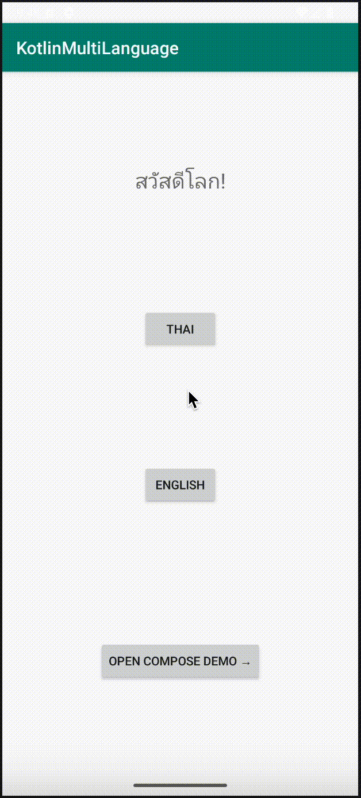

# KotlinLocalization


[](https://github.com/ninenox/KotlinLocalization/actions/workflows/ci.yml)
[](LICENSE)
[](https://search.maven.org/artifact/io.github.ninenox/kotlin-locale-manager)

Android Kotlin library for changing the UI language at runtime. Supports Views, Jetpack Compose, and Android 13+ per-app language settings.




# Quick Start

**1. Add dependency**
```kotlin
implementation("io.github.ninenox:kotlin-locale-manager:1.3.0")
```

**2. Create Application class**
```kotlin
class App : ApplicationLocale()
```
Register in `AndroidManifest.xml`:
```xml
<application android:name=".App" ... />
```

**3. Extend your Activity**
```kotlin
class MainActivity : AppCompatActivityBase() {
    override fun onCreate(savedInstanceState: Bundle?) {
        super.onCreate(savedInstanceState)
        setContentView(R.layout.activity_main)
    }
}
```

**4. Switch language**
```kotlin
setNewLocale(LocaleManager.LANGUAGE_THAI)   // from AppCompatActivityBase
setNewLocale("fr")                           // any BCP 47 tag works
```

That's it. The UI refreshes automatically.

---

# Installation

Add `mavenCentral()` to your repositories and include the dependency in your module build file:

```kotlin
// build.gradle.kts
repositories {
    mavenCentral()
}

dependencies {
    implementation("io.github.ninenox:kotlin-locale-manager:1.3.0")
}
```


# Getting Started

### 1. Create a class and extend `ApplicationLocale`

```kotlin
class App : ApplicationLocale()
```

### 2. Register it in `AndroidManifest.xml`

```xml
<application
    android:name=".App"
    ... />
```

> **Android 13+ (API 33):** To make your app's language appear in **Settings → App language**, also add a locale config file:
> ```xml
> <application
>     android:name=".App"
>     android:localeConfig="@xml/locale_config"
>     ... />
> ```
> Create `res/xml/locale_config.xml` listing the languages your app supports. See the [Android docs](https://developer.android.com/guide/topics/resources/app-languages#use-localeconfig) for the format.

### 3. Add locale-specific string resources

```
res/
  values/strings.xml        ← default (English)
  values-th/strings.xml     ← Thai
  values-ja/strings.xml     ← Japanese
```

### 4. Extend `AppCompatActivityBase` in your Activity

```kotlin
class MainActivity : AppCompatActivityBase() {
    override fun onCreate(savedInstanceState: Bundle?) {
        super.onCreate(savedInstanceState)
        setContentView(R.layout.activity_main)
    }
}
```

For Fragments, extend `FragmentBase` instead:

```kotlin
class SettingsFragment : FragmentBase() { ... }
```

### 5. Change the language

Call `setNewLocale()` from any `AppCompatActivityBase` subclass. The UI refreshes automatically.

```kotlin
setNewLocale(LocaleManager.LANGUAGE_THAI)
setNewLocale(LocaleManager.LANGUAGE_JAPANESE)
setNewLocale("fr") // any BCP 47 tag works
```

### 6. Read the current language code

```kotlin
ApplicationLocale.localeManager?.language // e.g. "en", "th"
```

### 7. Get the current `Locale` instance

```kotlin
val locale = LocaleManager.getLocale(resources)

if (locale.country == "TH") { /* ... */ }

val dateFormat = java.text.DateFormat.getDateInstance(java.text.DateFormat.SHORT, locale)
val formatted = dateFormat.format(java.util.Date())
```

### 8. Jetpack Compose

Use `rememberLocaleManager()` to get the manager and observe changes:

```kotlin
@Composable
fun MyScreen() {
    val localeManager = rememberLocaleManager() ?: return
    val context = LocalContext.current
    val language by localeManager.localeAsState()

    Text("Current language: $language")
    Button(onClick = { localeManager.setNewLocale(context, LocaleManager.LANGUAGE_THAI) }) {
        Text("Switch to Thai")
    }
}
```

Or observe the full `Locale` object:

```kotlin
val locale by localeManager.currentLocaleAsState()
```

Inject via CompositionLocal:

```kotlin
CompositionLocalProvider(LocalLocaleManager provides ApplicationLocale.localeManager) {
    val manager = LocalLocaleManager.current
    Button(onClick = { manager?.setNewLocale(context, LocaleManager.LANGUAGE_THAI) }) {
        Text("Switch to Thai")
    }
}
```

### 9. Without extending `AppCompatActivityBase`

If you already have a custom base Activity and cannot change it, use `LocaleHelper` instead:

```kotlin
class MainActivity : MyCustomBaseActivity() {
    override fun attachBaseContext(newBase: Context) {
        super.attachBaseContext(LocaleHelper.wrap(newBase))
    }

    override fun applyOverrideConfiguration(config: Configuration?) {
        LocaleHelper.applyOverrideConfiguration(baseContext, config)
        super.applyOverrideConfiguration(config)
    }

    fun changeLanguage() {
        LocaleHelper.setNewLocale(this, LocaleManager.LANGUAGE_THAI)
    }
}
```

### 10. Observe in a ViewModel

`LocaleManager` exposes `StateFlow` properties you can collect in a ViewModel or convert to `LiveData`:

```kotlin
// StateFlow<String> — language code
val languageFlow: StateFlow<String> = localeManager.localeFlow

// StateFlow<Locale> — typed Locale
val localeFlow: StateFlow<Locale> = localeManager.currentLocaleFlow

// LiveData (requires lifecycle-livedata-ktx)
val localeLiveData: LiveData<Locale> = localeManager.currentLocaleFlow.asLiveData()
```


# Supported Languages

Built-in constants in `LocaleManager`:

| Constant | Tag | Language |
|---|---|---|
| `LANGUAGE_ENGLISH` | `en` | English |
| `LANGUAGE_THAI` | `th` | Thai |
| `LANGUAGE_JAPANESE` | `ja` | Japanese |
| `LANGUAGE_KOREAN` | `ko` | Korean |
| `LANGUAGE_CHINESE_SIMPLIFIED` | `zh-CN` | Chinese (Simplified) |
| `LANGUAGE_CHINESE_TRADITIONAL` | `zh-TW` | Chinese (Traditional) |
| `LANGUAGE_ARABIC` | `ar` | Arabic |
| `LANGUAGE_SPANISH` | `es` | Spanish |
| `LANGUAGE_FRENCH` | `fr` | French |
| `LANGUAGE_GERMAN` | `de` | German |
| `LANGUAGE_PORTUGUESE` | `pt` | Portuguese |
| `LANGUAGE_PORTUGUESE_BRAZIL` | `pt-BR` | Portuguese (Brazil) |
| `LANGUAGE_RUSSIAN` | `ru` | Russian |
| `LANGUAGE_ITALIAN` | `it` | Italian |
| `LANGUAGE_HINDI` | `hi` | Hindi |
| `LANGUAGE_INDONESIAN` | `id` | Indonesian |
| `LANGUAGE_VIETNAMESE` | `vi` | Vietnamese |
| `LANGUAGE_MALAY` | `ms` | Malay |
| `LANGUAGE_TURKISH` | `tr` | Turkish |
| `LANGUAGE_DUTCH` | `nl` | Dutch |
| `LANGUAGE_POLISH` | `pl` | Polish |
| `LANGUAGE_UKRAINIAN` | `uk` | Ukrainian |
| `LANGUAGE_BENGALI` | `bn` | Bengali |
| `LANGUAGE_FARSI` | `fa` | Farsi / Persian |

Any valid [BCP 47](https://tools.ietf.org/html/bcp47) language tag also works — pass it directly as a string.


# vs. Android's Built-in Per-App Language (API 33+)

Android 13 introduced `AppCompatDelegate.setApplicationLocales()` as a system-level solution. Here's how this library relates to it:

| | KotlinLocalization | Android built-in only |
|---|---|---|
| Min API | 21 | 21 (AppCompat backport) |
| Appears in system Settings → App language | ✓ (API 33+) | ✓ |
| Works without `android:localeConfig` | ✓ | requires it for Settings integration |
| `StateFlow` / Compose support | ✓ | manual wiring needed |
| `FragmentBase` helper | ✓ | manual |
| Single-line language switch | ✓ `setNewLocale("th")` | multi-step setup |

This library wraps `AppCompatDelegate` on API 33+ so you get system-level integration automatically while keeping a simple, unified API across all API levels.


# Limitations

- If you cannot extend `AppCompatActivityBase`, use `LocaleHelper.wrap()` / `LocaleHelper.setNewLocale()` directly in your Activity (see [Without extending AppCompatActivityBase](#9-without-extending-appcompatactivitybase)).
- RTL languages (Arabic, Farsi, Hebrew) require `android:supportsRtl="true"` in `AndroidManifest.xml` for layout mirroring.
- The language setting is stored in `SharedPreferences` on API < 33 and in system storage on API 33+. Clearing app data resets the language to system default.
- Dark mode / night mode is preserved correctly. `AppCompatActivityBase` retains `uiMode` when applying locale overrides, so switching language does not reset the dark/light theme.
- If your Activity uses a custom `AppCompatDelegate` or theme engine (e.g. Aesthetic), you may need to call `applyOverrideConfiguration` manually.


## Testing

Run unit tests with Gradle:

```
./gradlew test
```


## License

Licensed under the Apache License 2.0. See the [LICENSE](LICENSE) file for details.
